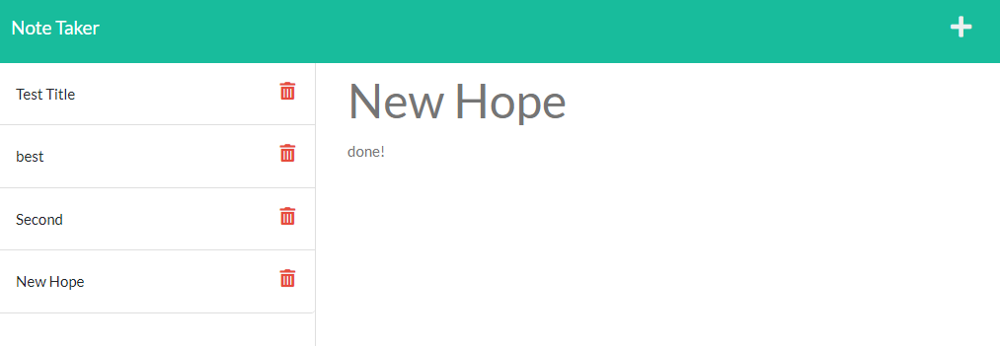

# **Server Note Taker**

## **Thumbnail**

## **Description**

- An application that can write and save notes from a JSON file.

## **Built With**

- HTML
- CSS
- JAVASCRIPT
- EXPRESS.JS

## **Table of Contents**

- [Installation](#installation)
- [Usage](#usage)
- [License](#license)
- [Contributing](#contributing)
- [Testing](#testing)
- [Questions](#questions)
- [Deployment](#deployment)

## **Installation**

- dl from Github

## **Usage**

- run by: node server.js

## **License**

- ISC

## **Contributing**

How to Contrubute

- Open source baby

## **Testing**

- TBD

## **Questions**

Made with ❤️💧🩸

- www.github.com/JonCurls
- JonCurls@gmail.com

## **Deployment**

https://ancient-badlands-45876.herokuapp.com/
